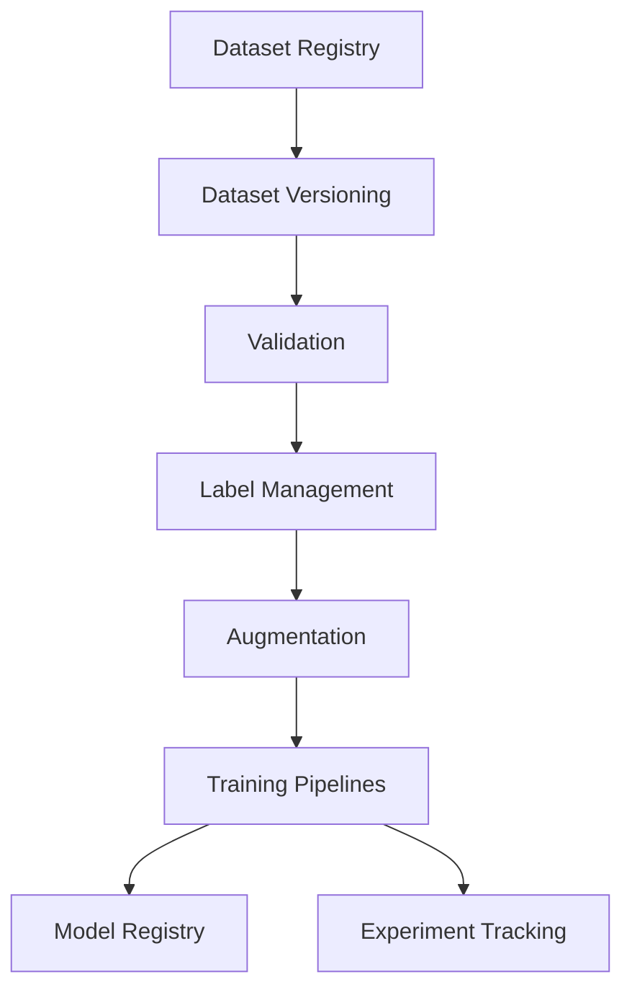

# Dataset and Training Architecture

```mermaid
flowchart TD
    A[Dataset Registry] --> B[Dataset Versioning]
    B --> C[Validation]
    C --> D[Label Management]
    D --> E[Augmentation]
    E --> F[Training Pipelines]
    F --> G[Model Registry]
    F --> H[Experiment Tracking]
```
