# Sentient Being Welfare Monitoring Platform - Documentation

This guide provides technical specifications, deployment instructions, developer extension points, and user manual details for the 2026 production-grade full-stack AI monitoring platform.

---

## 1. Dashboard Architecture

The application is structured as a decoupled full-stack platform consisting of:
1.  **FastAPI REST API Service (`api_server.py`)**: Runs on port `8000`. Acts as the central data storage coordinator, inference engine interface, alerts manager, MLOps logging service, and system health checker.
2.  **Streamlit Visualization Frontend (`dashboard.py`)**: Runs on port `8501`. Queries the REST API via a secure HTTP channel. If the server is offline, the frontend falls back gracefully to a localized python import logic with direct CSV database access (Local Fallback Mode).

```mermaid
graph TD
    subgraph Streamlit Frontend Port 8501
    UI[dashboard.py] --> Nav[Sidebar Module Router]
    Nav --> Page1[Dashboard]
    Nav --> Page2[Live Monitoring]
    Nav --> Page3[History]
    Nav --> Page4[Analytics]
    Nav --> Page5[Evaluation]
    Nav --> Page6[Training]
    Nav --> Page7[Models]
    Nav --> Page8[Dataset]
    Nav --> Page9[Alerts]
    Nav --> Page10[System Health]
    Nav --> Page11[Settings]
    Nav --> Page12[User Management]
    end
    
    subgraph FastAPI REST Service Port 8000
    UI -- REST HTTP Requests --> API[api_server.py]
    API --> Inf[POST /api/inference]
    API --> Hist[GET /api/history]
    API --> Ana[GET /api/analytics]
    API --> Train[POST /api/training/run]
    API --> Eval[GET /api/evaluation]
    API --> DB[GET /api/dataset]
    API --> Mod[POST /api/models/active]
    API --> Alr[POST /api/alerts/acknowledge]
    API --> Hlt[GET /api/health]
    end
```



---

## 2. API Reference

All requests must be directed to `http://127.0.0.1:8000/`.

### 1. Run Inference
*   **Endpoint**: `POST /api/inference`
*   **Request Body**:
    ```json
    {
      "video_result": {
        "detections": [{"class": "dog", "confidence": 0.89, "xyxy": [10, 20, 100, 200]}],
        "motion_score": 0.12,
        "agitated": false,
        "error": null
      },
      "audio_result": {
        "distress": true,
        "score": 0.65,
        "error": null
      },
      "sensor_result": {
        "temp": 32.5,
        "humidity": 60.0,
        "heart_rate": 115,
        "error": null
      },
      "ontology_strength": 0.6
    }
    ```
*   **Response**: Returns fused suffering probability, raw score, individual modality scores, triggered ontology explanations, and latency times.

### 2. Retrieve Logs History
*   **Endpoint**: `GET /api/history`
*   **Response**: Returns list of all previous inference logs.

### 3. Retrieve Analytics
*   **Endpoint**: `GET /api/analytics`
*   **Response**: Returns daily/hourly trends and summary aggregates (e.g. mean probability, maximum probability, total runs).

### 4. Model Switching Configuration
*   **Endpoint**: `POST /api/models/active`
*   **Request Body**:
    ```json
    {
      "model_version": "welfare-fusion-v2-beta"
    }
    ```
*   **Response**: `{"message": "Successfully activated model 'welfare-fusion-v2-beta'."}`

### 5. Fetch/Acknowledge Alerts
*   **Endpoint**: `GET /api/alerts` (fetch active alerts)
*   **Endpoint**: `POST /api/alerts/acknowledge` (acknowledge alert)
    *   **Body**: `{"alert_id": "alert_risk_1719876543"}`

### 6. System Resource Health
*   **Endpoint**: `GET /api/health`
*   **Response**: Returns CPU, RAM, Disk usages, active device connection states (Webcam, Mic, Sensors), and inference FPS.

---

## 3. Deployment & Quickstart Guide

### Prerequisites
- Python 3.8+
- FFmpeg (fully installed and available on system PATH)

### Step 1: Install Dependencies
Ensure you are in the project root directory and execute:
```bash
.\.venv\Scripts\pip install -r requirements.txt
```

### Step 2: Run the Platform (Recommended Launcher)
Launch both the API backend server and Streamlit frontend concurrently using:
```bash
.\.venv\Scripts\python run_platform.py
```
This utility spins up:
-   The REST backend on `http://127.0.0.1:8000`
-   The Streamlit GUI on `http://localhost:8501`

### Step 3: Run the Verification Test Suite
Verify endpoint integrity and code status by running the test suite:
```bash
$env:PYTHONPATH="."; .\.venv\Scripts\python tests/test_platform.py
```

---

## 4. User Manual

### Role-Based Access Control (RBAC) Permissions
Enforce specific views based on roles selected in the sidebar:
-   **Administrator**: Full permission matrix. Can hot-switch model versions, start pipeline training, modify weights/threshold config, and clear audit logs.
-   **Researcher**: Focuses on training and performance metrics. Can trigger training runs, view evaluation benchmark comparisons, and access datasets registry. Cannot switch deployed models or alter user parameters.
-   **Operator**: Alert inbox and monitoring manager. Can trigger live monitoring, evaluate explainability reasoning, and acknowledge alerts. Denied access to training or configuration adjustments.
-   **Viewer**: Read-only access. Can view Dashboard graphs, Live Monitoring, History list, and Analytics plots.

---

## 5. Developer Guide

### Project Directory Structure
```
├── api_server.py         → FastAPI REST backend server
├── dashboard.py          → Streamlit GUI application with modular page routing
├── run_platform.py       → Launcher utility running uvicorn + streamlit
├── tests/
│   └── test_platform.py  → Integration tests for FastAPI endpoints
├── dataset/
│   └── registry/         → JSON-based dataset registry database
├── training/
│   ├── registry/         → JSON-based models registry database
│   └── tracking/         → JSON-based experiments tracking logs
└── evaluation/
    └── experiments/      → JSON-based evaluation history database
```

### Extending Modalities
To introduce a new sensor or audio feature:
1.  Extend validation checks in `api_server.py` (`check_alert_heuristics`).
2.  Update the data payload structure in the GUI's live run loops (`dashboard.py`).
3.  Add matching pipeline evaluation logic inside the `training/pipelines/` sub-package.
