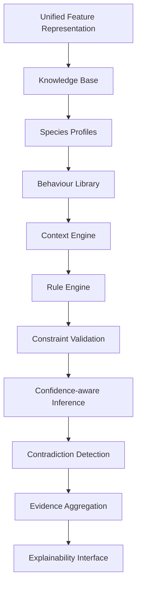

# Welfare Reasoning Architecture

## Components

- KnowledgeBase: configuration-driven species, behaviour, environment, and rule definitions.
- ContextEngine: adjusts reasoning with time, crowding, environment, occupancy, and quality signals.
- RuleEngine: evaluates nested AND/OR/NOT/threshold/weighted rules from configuration.
- ConstraintValidator: flags conflicting states such as sleeping + running.
- ConfidenceAwareInferenceEngine: combines evidence, confidence, uncertainty, and contradiction status.
- WelfareReasoningEngine: orchestrates the pipeline and exposes a stable plugin interface for future backends.
